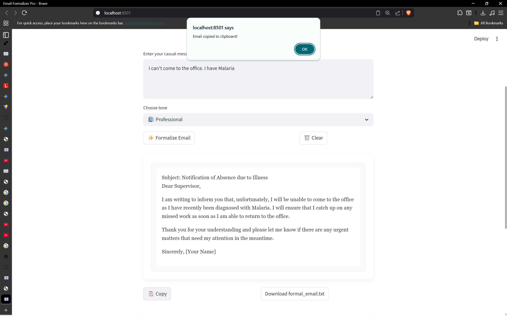

# ✉️ Email Formalizer using Generative AI

[](https://www.python.org/)
[](https://streamlit.io/)
[](https://github.com/divyanshu02raj/Email-Formalizer-using-Generative-AI/stargazers)
[](https://github.com/divyanshu02raj/Email-Formalizer-using-Generative-AI/network/members)
[](https://github.com/divyanshu02raj/Email-Formalizer-using-Generative-AI/issues)
[](LICENSE)

Transform casual messages into polished professional emails using AI. Powered by **LLaMA3 8B** via the **Groq API**.


---

## Table of Contents
- [Project Overview](#project-overview)
- [Key Features](#key-features)
- [Installation Instructions](#installation-instructions)
- [Usage](#usage)
- [Screenshots](#screenshots)
- [Demo](#demo)
- [Testing](#testing)
- [Results](#results)
- [Future Work](#future-work)
- [Contributing](#contributing)
- [Acknowledgments](#acknowledgments)

---

## Project Overview

The **Email Formalizer** converts informal text into professional emails automatically. Using **Generative AI**, the system ensures grammatically correct, contextually relevant, and polished output. The app is built with **Streamlit**, providing an intuitive UI for users.

---

## Key Features

- Transform casual messages into formal professional emails.
- Supports multiple tones: Professional, Friendly, Concise, Formal, Persuasive, Diplomatic.
- Copy to clipboard and download generated emails as `.txt`.
- Maintains conversation history for easy reuse.
- Powered by **LLaMA3 8B** via Groq API.

---

## Installation Instructions

### Step 1: Clone the repository
```bash
git clone https://github.com/divyanshu02raj/Email-Formalizer-using-Generative-AI.git
cd Email-Formalizer-using-Generative-AI
```

### Step 2: Set up a Python Virtual Environment (Recommended)

```bash
python -m venv venv
# Windows
venv\Scripts\activate
# macOS/Linux
source venv/bin/activate
```

### Step 3: Install Dependencies

```bash
pip install -r requirements.txt
```

### Step 4: Configure Environment Variables

Create a `.env` file in the project root and add your Groq API key:

```env
GROQ_API_KEY=your_api_key_here
```

### Step 5: Run the Application

```bash
streamlit run app.py
```

The app will launch in your default web browser.

---

## Usage

1. Enter an informal sentence in the text input field. 
2. Choose the desired tone.
3. Click ✨ Formalize Email to generate a professional email.
4. Copy or download the generated email.
5. Review your recent conversation history for previous messages.

**Example:**

* **Input:**
  `"Hey, can you send me the report?"`
* **Output:**
  `"Dear [Name], I hope you are well. Could you kindly send me the report at your earliest convenience?"`

---

## Screenshots

1. **App Start Screen**  
   

2. **Entering a Casual Message**  
   Casual message: `"I can't come to the office. I have Malaria"`  
   

3. **Email Copied Alert**  
   

4. **Clipboard Content**  
   

5. **Downloading Email as TXT**  
   

6. **TXT File Content**  
   

7. **Second Casual Message & Generated Email**  
   Casual message: `"I can't come to the school. I am going on a family trip."`  
   

8. **Previous Malaria Message Loaded from History**  
   

---

## Demo

- **Live Streamlit Demo:** [Add your demo link here](https://email-formalizer-using-generative-ai.onrender.com/)  
- **Video Demo (Optional):** [Add video link here](https://www.youtube.com/watch?v=t7h1GEdLVbk)
- **Connect on LinkedIn:** [Divyanshu Raj](https://www.linkedin.com/in/div02raj/)


---

## Testing

The system has been tested extensively:

* **Unit Testing:** Individual components verified for correctness.
* **Integration Testing:** Smooth interaction between input, AI model, and output.
* **User Testing:** Collected feedback on UI/UX and output quality.
* **Performance Testing:** Evaluated response time for different input lengths.

---

## Results

* **Accuracy:** Generates grammatically correct and contextually relevant emails.
* **Response Time:** Fast and responsive even for long inputs.
* **Edge Cases:** Handles incomplete or unclear inputs gracefully, e.g., prompting clarification.

---

## Future Work

* Fine-tune the AI model on professional email datasets for higher accuracy.
* Implement real-time collaboration features for team use.
* Introduce user feedback mechanism for iterative improvements.
* Add multi-language support for global users.
* Enhance handling of complex email threads and multi-step communications.

---

## Contributing

Contributions are welcome! Follow these steps:

1. Fork the repository.
2. Create a feature branch:

   ```bash
   git checkout -b feature/your-feature
   ```
3. Make your changes and commit:

   ```bash
   git commit -m "Add new feature"
   ```
4. Push your branch:

   ```bash
   git push origin feature/your-feature
   ```
5. Submit a pull request for review.

---

## Acknowledgments

* **LLaMA3 8B Model** – Generates high-quality, professional emails.
* **Groq API** – Provides infrastructure to run LLaMA3.
* **Streamlit** – Powers the user-friendly interface.
* Open-source contributors for AI and NLP research and resources.
